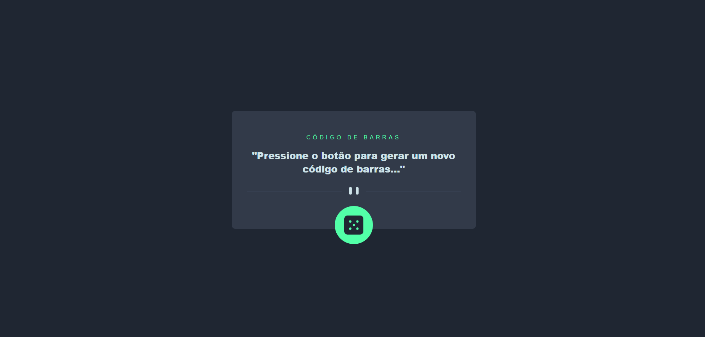

# EAN GENERATOR


> Este é um aplicativo simples para gerar um código de barras do tipo EAN 13

<div
  style="width:100%; display:flex; align-items:center; gap:16px" 
>


</div>

## Detalhes do aplicativo

- A proposta dessa aplicação é gerar um código de barras do tipo EAN 13 baseado no timestamp atual, ou seja, será um código único para ser utilizado
da maneira que desejar.


## 🚀 Melhorias implementadas
- [x] - Download do código de barras sendo o código como nome do arquivo de imagem
- [x] - Estilização com tailwind css


## 💻 Como usar o projeto
Para gerar uma cópia do projeto e implementar as suas melhorias, esteja em um computador com Node Js instalado e siga as etapas abaixo:

1  clone o projeto com o comando 
```
git clone https://github.com/devggui/ean-generator
``` 
2  Acesse o projeto pelo terminal com o comando 
```
cd ean-generator
```  
3  Instale as dependências necessárias com o comando
```
npm install
```

4  Rode o projeto com o comando
```
npm run dev
``` 
5  Ou acesse o aplicativo na web através do link a seguir: [Ean Generator](https://eangenerate.netlify.app)


## 🌐 Links úteis
[ReactJS](https://react.dev)  
[Tailwind CSS](https://tailwindcss.com)  


## 🧑‍💻 Guilherme Henrique

[](https://www.linkedin.com/in/devggui)
[](https://gthub.com/devggui)
[](http://wa.me/5514998619263)
[](https://devggui.netlify.app)